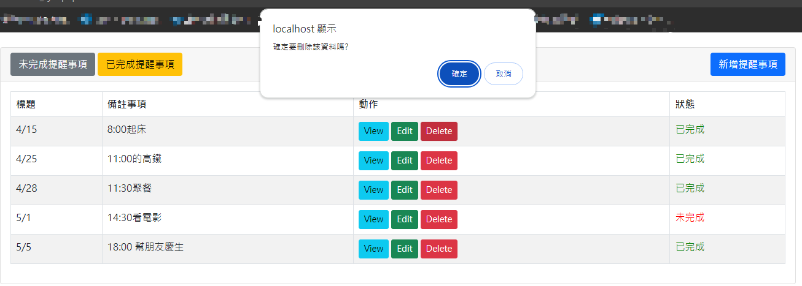

# php_reminder_app

This is a simple PHP Reminder App that allows users to create, edit, and delete reminders. Users can set a title, description for each reminder. Reminders are stored in a MySQL database.

### Features
1. Create Reminder: Users can create new reminders with a title, description.
2. Edit Reminder: Edit existing reminders to update their title, description.
3. Delete Reminder: Remove reminders that are no longer needed.
4. View Reminder List: See a list of all reminders with their details.

### Technologies Used
PHP: Backend logic and server-side scripting.  
MySQL: Database management for storing reminders.  
HTML/CSS: Frontend design and structure.  
Bootstrap: Frontend framework for responsive design.

### Requirement
- PHP 8.2.12, Apache 2.4, MariaDB

###  Module Descriptions
|Name |module|
|-----|--------|
|dbcon.php|MySQL DB connection|
|notification_ajax.php|frontend|
|code.php  |backend|
|fetch_task.php  |backend - for view different status of taskes|

### Screenshots
- index (view all)
    
  - index (view status unfinished)
    
  - index (view status finished)
    
- create new reminders
    
- Edit Reminder
    
- Delete Reminder
    
- View Reminder
    